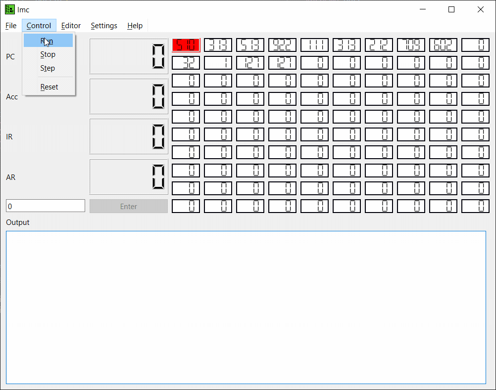

# LMC

An emulator for the [Little Man Computer](https://en.wikipedia.org/wiki/Little_man_computer).

Example programs can be found in `/programs`.

## Build Requirements

- [lmc-compiler](https://www.github.com/HarryWhitehorn/lmc-compiler)
    - [Bison](https://www.gnu.org/software/bison/) [3.0]
    - [Flex](https://www.gnu.org/software/flex/) [2.6]
    - [Gengetopts](https://www.gnu.org/software/gengetopt/gengetopt.html#Installation) [2.23] (cli only)
- QT 6.5

## Menus

- File
    - Open
        - Open a `.txt` into the editor
        - Open a `.lmc` into memory (and reset)
    - Exit
        - Exit program
- Control
    - Run
        - Start `lmc` mainloop
    - Stop
        - Stop `lmc` mainloop
    - Step
        - Step `lmc` PC counter
    - Reset
        - Step all memory and registers to zero
- Editor
    - Editor
        - Opens the plaintext editor (see [Editor](#editor))
- Settings
    - Settings
        - Opens the settings menu (see [Settings](#settings))
- Help
    - Docs
        - Opens [readme.md](#lmc)
    - About
        - Open about popup

## Editor

### Menu

- File
    - Open
        - Opens a `.txt` into the editor
    - Save
        - Save current editor content as a `.txt`
        - Save current editor content as a `.lmc`
    - Close
        - Hides the editor
- Load
    - Load
        - Loads the `.txt` editor content into the `lmc` memory as `.lmc`

## Settings

- Delay
    - Change delay timing (0ms for no delay) [`default: 200ms`]
- Output
    - Toggle auto-append char(s) to end of output w/ char(s) input (`'\n'` for newline) [`default: true && '\n'`]
    - Toggle auto-clear on reload/load [`default: false`]
    - Clear output now
    - Toggle autoscroll [`default: true`]
- Palette
    - Toggle PC Highlight w/ color select [`default: true && red`]
    - Toggle AR Highlight w/ color select [`default: true && green`]

## TODO

- Improve/polish UI
    - Limit output size and priorities memory size on fullscreen
- Add live memory edit
- Rewrite using QML

### Bugs

- Stopping a running program will prevent the user from stepping through.
- Changing color in setting will not be reflected until lmc is stepped.
